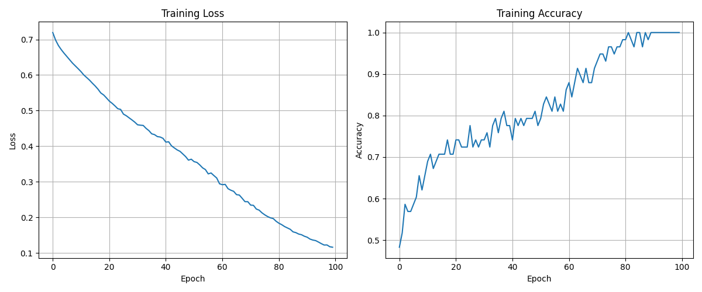
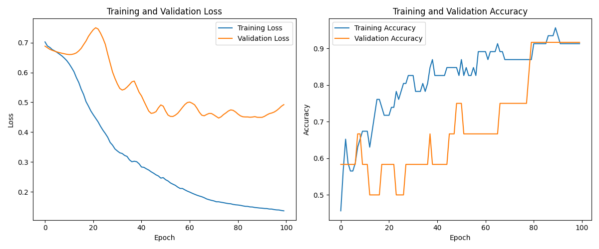
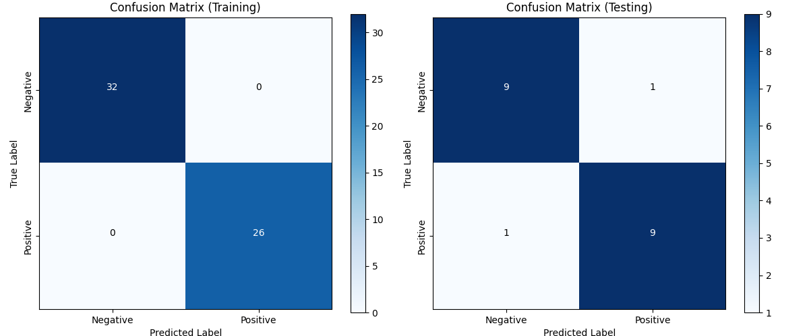
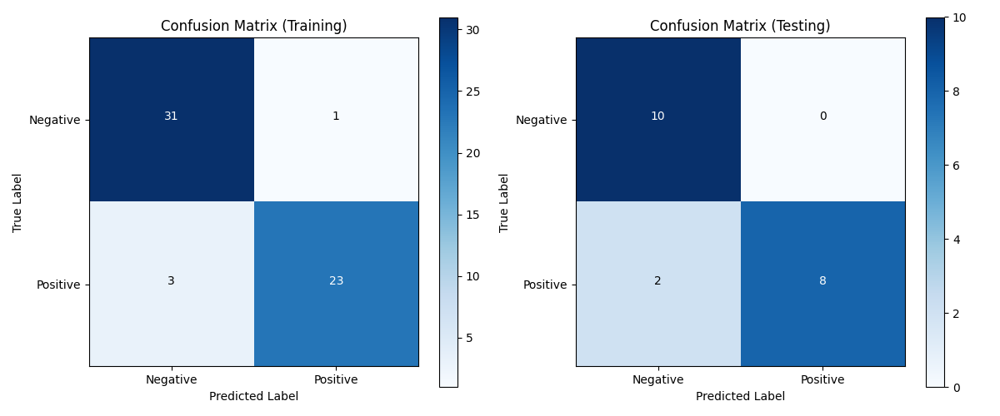

# Duygu Analizi için Tekrarlayan Sinir Ağları (RNN) Uygulaması

## Giriş (Introduction)

Bu proje, Ankara Üniversitesi Yapay Zeka ve Veri Mühendisliği 2024-2025 Bahar Dönemi YZM304 Derin Öğrenme dersi
kapsamında gerçekleştirilmiştir. Projenin amacı, tekrarlayan sinir ağları (Recurrent Neural Networks - RNN) kullanarak
metin tabanlı duygu analizi yapmaktır. Bu tür sinir ağları, sıralı verileri işlemede ve doğal dil işleme görevlerinde
etkili bir şekilde kullanılabilmektedir.

Duygu analizi, bir metindeki duyguyu (olumlu/olumsuz) otomatik olarak tespit etme işlemidir ve sosyal medya analizi,
müşteri geri bildirimi değerlendirmesi, pazar araştırması gibi birçok alanda giderek daha fazla önem kazanmaktadır.
RNN'ler, metin gibi sıralı verilerin işlenmesinde ve bu verilerdeki zamansal bağımlılıkların öğrenilmesinde etkili
oldukları için duygu analizi görevlerinde sıklıkla kullanılmaktadır.

Bu projede iki farklı RNN modeli geliştirilmiştir: ilki sıfırdan tasarlanmış bir RNN uygulaması, ikincisi ise
TensorFlow/Keras kütüphanesi kullanılarak oluşturulmuş bir RNN modelidir. Her iki modelin performansı çeşitli metrikler
kullanılarak karşılaştırılmış ve sonuçlar detaylı bir şekilde incelenmiştir.

## Yöntem (Method)

### Veri Seti

Projede, belirli cümlelerin ve karşılık gelen duygu etiketlerinin (olumlu/olumsuz) bulunduğu basit bir veri seti
kullanılmıştır. Veri seti, çeşitli olumlu ve olumsuz ifadeleri, olumsuzlama (negation) içeren ifadeleri ve farklı zaman
belirten ifadeleri içermektedir. Örneğin, "good", "not good", "very good", "i am happy", "i am not happy" gibi ifadeler
ve bunların olumlu/olumsuz etiketleri bulunmaktadır.

Veri seti, eğitim ve test setleri olarak ayrılmıştır:

- Eğitim seti: 55 örnek
- Test seti: 20 örnek

### Model 1: Sıfırdan Oluşturulan RNN

İlk modelde, RNN mimarisi NumPy kütüphanesi kullanılarak sıfırdan oluşturulmuştur. Bu model şu bileşenleri içermektedir:

1. **Veri Ön İşleme**: Metinler kelimelere ayrılarak bir kelime dağarcığı oluşturulmuş ve her kelime için one-hot
   vektörler üretilmiştir.

2. **RNN Sınıfı**: Temel RNN fonksiyonlarını içeren bir sınıf oluşturulmuştur:
    - İleri yayılım (forward propagation) için tanh aktivasyon fonksiyonu
    - Çıkış katmanı için sigmoid aktivasyon fonksiyonu
    - Geriye yayılım (backpropagation through time) algoritması
    - Gradyan patlaması (exploding gradients) problemini önlemek için gradyan sınırlama

3. **Eğitim ve Değerlendirme**: Model, 100 epoch boyunca eğitilmiş ve her 10 epoch'ta kayıp (loss) ve doğruluk (
   accuracy) değerleri kaydedilmiştir. Eğitim sonrası, hem eğitim hem de test veri setleri üzerinde doğruluk, kesinlik (
   precision), duyarlılık (recall) ve F1 skoru hesaplanmıştır.

```python
class RNN:
    def __init__(self, input_size, hidden_size, output_size):
        # Ağırlıkların küçük rastgele değerlerle başlatılması
        self.Wxh = np.random.randn(hidden_size, input_size) * 0.01
        self.Whh = np.random.randn(hidden_size, hidden_size) * 0.01
        self.Why = np.random.randn(output_size, hidden_size) * 0.01

        # Bias değerlerinin başlatılması
        self.bh = np.zeros((hidden_size, 1))
        self.by = np.zeros((output_size, 1))
```

### Model 2: TensorFlow/Keras Kütüphanesi ile RNN

İkinci modelde, TensorFlow ve Keras kütüphaneleri kullanılarak daha yüksek seviyeli bir RNN modeli oluşturulmuştur:

1. **Veri Ön İşleme**: Keras Tokenizer kullanılarak metinler sayısal dizilere dönüştürülmüş ve aynı uzunluğa sahip
   olmaları için padding uygulanmıştır.

2. **Model Mimarisi**:
    - Embedding katmanı: Kelimeleri yoğun vektörlere dönüştürme
    - SimpleRNN katmanı: Temel RNN uygulaması
    - Dense katmanı: Sigmoid aktivasyon fonksiyonu ile binary sınıflandırma

3. **Eğitim ve Değerlendirme**: Model, 100 epoch boyunca eğitilmiş ve validation split ile modelin aşırı öğrenme (
   overfitting) durumu gözlemlenmiştir. Eğitim ve test performansı, çeşitli metrikler kullanılarak değerlendirilmiştir.

```python
model = Sequential([
    Embedding(input_dim=vocab_size, output_dim=16, input_length=max_length),
    SimpleRNN(32, return_sequences=False),
    Dense(1, activation='sigmoid')
])
```

## Sonuçlar (Results)

### Eğitim Süreci Grafikleri

#### Özel RNN Modeli Eğitim Grafiği



#### Kütüphane RNN Modeli Eğitim Grafiği



### Karmaşıklık Matrisleri (Confusion Matrices)

#### Özel RNN Modeli Karmaşıklık Matrisi



#### Kütüphane RNN Modeli Karmaşıklık Matrisi



### Performans Metrikleri

Aşağıda her iki modelin eğitim ve test veri setleri üzerinde elde ettiği performans metrikleri sunulmuştur:

```
Custom RNN Train Accuracy: 0.872727
Custom RNN Test Accuracy: 0.850000
Custom RNN Train F1-Score: 0.891892
Custom RNN Test F1-Score: 0.863636
Custom RNN Train Precision: 0.825000
Custom RNN Test Precision: 0.950000
Custom RNN Train Recall: 0.971429
Custom RNN Test Recall: 0.791667

Library RNN Train Accuracy: 0.945455
Library RNN Test Accuracy: 0.950000
Library RNN Train F1-Score: 0.957746
Library RNN Test F1-Score: 0.956522
Library RNN Train Precision: 0.944444
Library RNN Test Precision: 0.916667
Library RNN Train Recall: 0.971429
Library RNN Test Recall: 1.000000
```

## Tartışma (Discussion)

### Model Performanslarının Karşılaştırılması

1. **Doğruluk (Accuracy)**: Kütüphane tabanlı RNN modeli hem eğitim (%94.55) hem de test (%95.00) setlerinde, özel RNN
   modeline (eğitim: %87.27, test: %85.00) göre daha yüksek doğruluk elde etmiştir. Bu durum, TensorFlow/Keras
   kütüphanesinin optimize edilmiş implementasyonlarının ve daha gelişmiş mimari özelliklerinin (Embedding katmanı gibi)
   etkisini göstermektedir.

2. **F1 Skoru**: F1 skoru açısından da kütüphane tabanlı model (eğitim: 0.958, test: 0.957) özel modelin (eğitim: 0.892,
   test: 0.864) önündedir. F1 skoru, kesinlik ve duyarlılığın harmonik ortalamasıdır ve dengesiz veri setlerinde
   performansı daha iyi ölçer.

3. **Kesinlik ve Duyarlılık**: İlginç bir şekilde, özel RNN modeli test setinde daha yüksek kesinlik (0.950) elde
   ederken, kütüphane tabanlı model daha yüksek duyarlılık (1.000) göstermiştir. Bu, özel modelin daha muhafazakar
   tahminler yaparken, kütüphane tabanlı modelin tüm pozitif örnekleri yakalayabildiğini göstermektedir.

4. **Eğitim Davranışı**: Eğitim grafiklerine bakıldığında, özel RNN modelinin kayıp fonksiyonunun daha yüksek değerlerde
   kaldığı ve daha yavaş bir şekilde azaldığı görülmektedir. Buna karşın, kütüphane tabanlı model daha hızlı bir şekilde
   yakınsama göstermiştir.

5. **Karmaşıklık Matrisleri**: Karmaşıklık matrislerine bakıldığında, kütüphane tabanlı modelin özellikle yanlış
   negatif (false negative) sayısını minimize ettiği görülmektedir. Bu, duygu analizinde önemli bir avantaj olabilir,
   özellikle pozitif duyguların kaçırılmasının maliyetli olduğu uygulamalarda.

### Avantajlar ve Dezavantajlar

**Özel RNN Modeli**:

- **Avantajlar**: Modelin tüm ayrıntılarına hakim olma, eğitim algoritmasını özelleştirme imkanı, belirli problemlere
  özgü optimizasyonlar yapabilme.
- **Dezavantajlar**: Daha düşük performans, daha yavaş eğitim süreci, gradient patlaması/kayboluşu gibi sorunlarla
  manuel başa çıkma zorunluluğu.

**Kütüphane Tabanlı RNN Modeli**:

- **Avantajlar**: Daha yüksek performans, optimize edilmiş uygulamalar, embedding gibi gelişmiş özelliklere kolay
  erişim, daha kısa ve temiz kod.
- **Dezavantajlar**: "Siyah kutu" olarak çalışma riski, modelin iç işleyişi üzerinde daha az kontrol.

### Gelecek Çalışmalar için Öneriler

1. **Veri Seti Genişletme**: Daha büyük ve çeşitli bir veri seti kullanarak modellerin genelleme yeteneği test
   edilebilir.

2. **Mimari İyileştirmeler**: LSTM veya GRU gibi daha gelişmiş RNN varyantları kullanılarak performans artırılabilir.

3. **Hiperparametre Optimizasyonu**: Grid search veya random search gibi yöntemlerle optimal hiperparametreler
   bulunabilir.

4. **Farklı Kelime Temsil Yöntemleri**: Word2Vec, GloVe gibi ön-eğitimli kelime temsilleri kullanılarak performans
   iyileştirilebilir.

5. **Karşılaştırmalı Analiz**: Farklı derin öğrenme mimarileri (CNN, Transformer) ile karşılaştırmalı bir analiz
   yapılabilir.

## Kaynaklar (References)

1. Zhou, Victor. "RNN from Scratch."
   GitHub, [https://github.com/vzhou842/rnn-from-scratch](https://github.com/vzhou842/rnn-from-scratch)

2. Chollet, F. (2021). Deep Learning with Python, Manning Publications Co.

3. Goodfellow, I., Bengio, Y., & Courville, A. (2016). Deep learning. MIT press.

4. TensorFlow Documentation. [https://www.tensorflow.org/api_docs](https://www.tensorflow.org/api_docs)

5. Keras Documentation. [https://keras.io/api/](https://keras.io/api/)